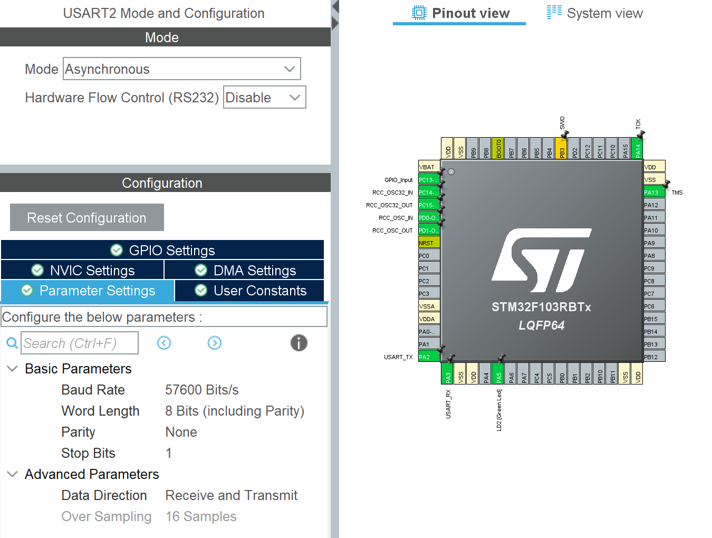

# Implementing Rosserial with STM32

This README provides instructions on how to implement `rosserial` for communication between a ROS (Robot Operating System) environment and an STM32 microcontroller. `rosserial` allows ROS nodes running on a computer to communicate with microcontrollers. 

The node can be published by the microcontroller to send useful information (for example, the encoder readings, or vehicle status); The microcontroller is also able to subscribe the node to receive command from the ROS.

## Prerequisites

Before you begin, ensure you have the following prerequisites:

- ROS (Noetic) installed on your computer.
- Windows & Ubuntu 20.04 (for ROS Noetic).
- STM32 micro-controller and its development environment (e.g., STM32CubeIDE is used in this example).
- STM32 board with available UART/USART ports (e.g., the example used STM32F103RB board).
- Basic knowledge of ROS and STM32 programming.

## Useful Links

- Rosserial Wiki: https://wiki.ros.org/rosserial
- Rosserial & STM32 packages: https://github.com/yoneken/rosserial_stm32
- ROS Publishers & Subscribers: https://wiki.ros.org/ROS/Tutorials/WritingPublisherSubscriber%28c%2B%2B%29
- Oracle VM Virtual Box: https://www.virtualbox.org/
- STM32CubeIDE: https://www.st.com/en/development-tools/stm32cubeide.html

## Rosserial Installation (Ubuntu)

This part refers to the YouTube tutorial done by 'Learn embedded systems with George' (Video Name: Interfacing STM32 boards to ROS using rosserial protocol | ROS | Learn with George), which is shown in the link below:

<a href="https://youtu.be/cq0HmKrIOt8?si=_NJrYihaPaCEl_g4" target="_blank">
    
</a>

The video provides useful instructions to setup the rosserial on Ubuntu virtual machine, which runs on the Oracle VM Virtual Box. It is strongly recommended that to create a share folder between the Windows and the Ubuntu virtual machine, so the installed rosserial STM32 library can be accessed directly on Windows.

The following sections are summarized based on the instructions in the video.


Using the following lines to install the correct version of rosserial library for the ROS Noetic:
   
```bash
$ clear
$ sudo apt install ros-noetic-rosserial
```
    
Run the ROS using the 'roscore':

```bash
$ roscore
```

Open a new terminal, use the following lines to check the existing nodes:

```bash
$ rostopic list
$ rostopic info /rosout
$ rosnode list
```

Close the checking node/topic terminal, open the new terminal to create a catkin workspace:

```bash
$ mkdir -p ~/catkin_stm32_ws/src
$ cd ~/catkin_stm32_ws/
$ catkin_make
```

Using 'ls' to check the catkin_stm32_ws now has 'build', 'develop', and 'src'.

Using the following commands to add the folder to ROS package path:

```bash
$ source devel/setup.bash 
$ echo $ROS_PACKAGE_PATH
$ roscd
$ cd ..
$ cat ~/.bashrc
```

Now it should display that the created workspace is loaded. Now go to the 'src' directory to clone the GitHub code for rosserial and STM32:

```bash
$ cd src/
$ git clone https://github.com/yoneken/rosserial_stm32.git
```

The 'rosserial_stm_32' should appears in the 'src' directory. Now go back to the workspace and compile the packages in the 'src' directory:

```bash
$ cd ..
$ catkin_make
$ source devel/setup.bash
```

Now, clone the rosserial repository using the following command:

```bash
$ git clone https://github.com/ros-drivers/rosserial.git
```

And copy the 'rosserial_python' to the catkin workspace we created before:

```bash
$ cd rosserial/
$ cp -avr ~/rosserial/rosserial_python/ ~/catkin_stm32_ws/src/
```

Same as before, compile the packages in the 'catkin_stm32_ws'. And:

```bash
$ cd ~/catkin_stm32_ws/
$ catkin_make
```

After compiling the packages, copy the chatter example in the 'rosserial_stm_32' to the Ubuntu home folder:

```bash
$ cd catkin_stm32_ws/src/rosserial_stm32/src/ros_lib/examples
$ cp -avr chatter ~/Documents/STM32
```

By doing the above commands, a new folder that contrains the chatter example will be created in the designated directory. You might want to check it using the following lines:

```bash
$ cd ~/Documents/STM32/
$ ls
```

__Note: Before runing the next command, check there is  'Inc' library inside the 'Documents/STM32/'__, if there is one, run the following command:

```bash
$ rosrun rosserial_stm32 make_libraries.py .
```

The rosrun will ask where to run the make_libraries.py, choose the one we used before with directory 'catkin_stm32_ws/src/rosserial_stm32/src/rosserial_stm32/make_libraries.py'.

At the step, the following error might occur:

'SyntaxError: Missing parentheses in call to 'print'. Did you mean print(__usage__)?'

This error can be fixed by editing the 'make_libraries.py'. You may want to find more details in the YouTube video to see where the changes should be made, using the following command to open the file and edit the file to add the missing parentheses:

```bash
$ sudo nano /home/ubuntu/catkin_stm32_ws/src/rosserial_stm32/src/rosserial_stm32/make_libraries.py
```

Save the edited file, then run the 'make_libraries.py' again. Now all the required ros packages should be exported to the directory '/Documents/STM32/Inc/'.

Now, the created repository could be copied to the shared folder to be operated on Windows (The shared folder directory might be differ based on your settings):

```bash
$ sudo cp -avr ~/Documents/STM32 /media/sf_VM_Share/
```

The 'STM32' folder that contains all the ROS packages and chatter examples should appear in the shared folder now.


## STM32 Code & Configuration (Windows)
After installing all the required dependencies on Ubuntu and save them into the shared folder, the following process is to configure the STM32 board's pin layout, as well as the rosserial header files.

1. **Pin Configuration (UART):**

    The communication protocol used between the STM32 micro-controller and the ROS is the UART (Universal Asynchronous Receiver/Transmitter), the features of this protocol is shown below:
    
    - __Two wires communication__: Only two wires are connected between the master and slave machine, which are the `Receiver (RX)` and `Transmitter (TX)`;

    - __Fixed Baud Rate__: there is no clock signal is required for asynchronous communication, which means certain baud rate should be chosen before starting the communication (e.g., 9600/57600/115200 etc.). The baud rate should be set as the same on both sides (ROS and STM32);

    - __Detailed Explanation__: More information of UART can be found here (from AnalogueDialogue): https://www.analog.com/en/analog-dialogue/articles/uart-a-hardware-communication-protocol.html

        

    Choose the correct board you are using in the STM32CubeIDE board selection page. Then in the 'Pinout & Configuration' panel, the UART pins are selected as 'PA2' and 'PA3' (for 'USART_TX' and 'USART_RX') of the STM32F103RB board.

    

    There are several settings to be done:
        
    - Set the baud rate to a designated one, in the example it is set to be 57600;
    - Set the 'Mode' to 'Asynchronous', keep 'Hardware Flow Control' disabled;
    - Enable the USART2 global interrupter under the 'NVIC Settings';
    - Add DMA requests under the 'DMA Settings' for 'USART2_TX' and 'USART2_RX' and set the priority to 'High'.

    All of these changes can be viewed in the '.ioc' files inside the repository.

    After completing all the pin configurations, click the 'Device Configuration Tool Code Generation' button to generate the code.

2. **Project Structure:**

    It is important to import all the necessary header files and ROS folders into the STM32 project. The following structure is recommended to organize all the files:

    ```
    STM32_project/
    │
    ├──Includes(auto-generated)
    |
    ├── Core/
    │ ├── Inc/
    | |  ├──all_ros_packages
    | |  ├──main.h (auto-generated)
    | |  ├──mainpp.h
    | |  ├──ros.h
    | |  ├──stm32f1xx_hal_conf.h (auto-generated)
    | |  ├──stm32f1xx_it.h (auto-generated)
    | |  └──STM32Hardware.h
    | |
    │ ├── Src/
    | |  ├──duration.cpp
    | |  ├──main.cpp(renamed from main.c)
    | |  ├──mainpp.cpp
    | |  ├──stm32f1xx_hal_msp.c
    | |  ├──stm32f1xx_it.c
    | |  ├──syscalls.c
    | |  ├──sysmem.c
    | |  ├──system_stm32f1xx.c    
    | |  └──time.cpp
    | |
    │ └── Startup(auto-generated)
    │
    ├── Drivers(auto-generated)
    │
    ├── STM32_project.ioc
    └── STM32_project.launch

    ``` 
    Note that when copy the ros packages into the 'STM32_Project/Core/Inc/', do not include the 'main.h','stm32f4xx_hal_it.h', and 'stm32f4xx_hal_conf.h' files because they have been generated automatically when the project is created.
    
    The 'duration.cpp' and 'time.cpp' are moved from the 'STM32_Project/Core/Inc/' to 'STM32_Project/Core/Src/'.

    Later the 'main.c' should be converted to the C++ file to be used in ROS.

    The complete example can be found in either the chatter or the LED blinking repos.


3. **main.c:**
    
    Inside the generated 'main.c' file, it contains all the configurations for the peripherals. Some modifications should be done to the code to include the 'setup()' and 'loop()' functions inside the 'mainpp.h' file.

    The first step is to include the 'mainpp.h' at the beginning of the 'STM32/Core/Src/main.c' file:

    ```cpp
    #include "mainpp.h" 
    ```

    Then find the main body of the user defined code, include 'setup()' and 'loop()'

    ```cpp
    int main(void)
    {
        // ... The other initialization code ...

        // Include 'setup()' from 'mainpp.h'
        setup();

        while(1)
        {
            // Include 'loop()' from 'mainpp.h'
            loop();
        }
    }

    ```

4. **STM32Hardware.h**

    The 'STM32Hardware.h' file contains the most important part of to publish the message to the ROS / subscribe the node to receive the message. 

    At the beginning of the header file, you need to select the board you are using or create one based on your board choice. Here I used the board I am using (STM32F103RB) to show the example:

    ```cpp
    #define STM32F1xx //Change for your device

    // Include the following header files of the selected board
    #ifdef STM32F1xx
    #include "stm32f1xx_hal.h"
    #include "stm32f1xx_hal_uart.h"
    ``` 
    
    There might be some datatype errors happen to the text buffer variable 'tbuf'. The following adjustment to the 'flush' method will be able to solve the problem:

    ```cpp
    void flush (void)
    {
        // ... previous code remains unchanged ...

        // Change the '&(tbuf)' to '(tbuf)' to fix the error
        HAL_UART_Transmit_DMA(huart, (tbuf), twind);

        // ... rest of code remains unchanged ...
    }

    ```

5. **mainpp.cpp**

    The 'mainpp.cpp' file inside the 'STM32_project/Core/Src/' directory contains the message that STM32 going to publish in ROS (for 'chatter_F103RB' publisher example), or the function that will be triggered (for 'LED_F103RB' subscriber example).

    __Through editing this file, the publisher and subscriber functions can be changed for different applications.__

    ```cpp
    // Publisher Example

    #include <mainpp.h>
    #include <ros.h>
    #include <std_msgs/String.h>

    ros::NodeHandle nh;

    std_msgs::String str_msg;
    ros::Publisher chatter("chatter", &str_msg);


    char hello[] = "Hello world from F103RB!";

    void HAL_UART_TxCpltCallback(UART_HandleTypeDef *huart){
    nh.getHardware()->flush();
    }

    void HAL_UART_RxCpltCallback(UART_HandleTypeDef *huart){
    nh.getHardware()->reset_rbuf();
    }

    void setup(void)
    {
    nh.initNode();
    nh.advertise(chatter);
    }

    void loop(void)
    {

    str_msg.data = hello;
    chatter.publish(&str_msg);
    nh.spinOnce();

    HAL_Delay(1000);
    }
    ```

    ```cpp
    // Subscriber Example: Blink onboard LED

    #include <mainpp.h>
    #include <ros.h>
    #include <std_msgs/Bool.h> // Assuming the messages are of type std_msgs/Bool

    ros::NodeHandle nh;

    #define LED2_PIN GPIO_PIN_5
    #define LED2_GPIO_PORT GPIOA

    // Define a callback function for the subscriber
    void ledControlCallback(const std_msgs::Bool& led_state) {
    if (led_state.data) {
        // Code to turn the LED ON
        HAL_GPIO_WritePin(LED2_GPIO_PORT, LED2_PIN, GPIO_PIN_SET); // Replace GPIOx and GPIO_PIN_y with actual LED pin
    } else {
        // Code to turn the LED OFF
        HAL_GPIO_WritePin(LED2_GPIO_PORT, LED2_PIN, GPIO_PIN_RESET); // Replace GPIOx and GPIO_PIN_y with actual LED pin
    }
    }

    // Initialize the subscriber with the topic name and the callback function
    ros::Subscriber<std_msgs::Bool> sub("led_control", &ledControlCallback);

    void HAL_UART_TxCpltCallback(UART_HandleTypeDef *huart){
    nh.getHardware()->flush();
    }

    void HAL_UART_RxCpltCallback(UART_HandleTypeDef *huart){
    nh.getHardware()->reset_rbuf();
    }

    void setup(void)
    {
    nh.initNode();
    // Register the subscriber
    nh.subscribe(sub);
    }

    void loop(void)
    {
    nh.spinOnce(); // This will call the ledControlCallback when a message is received

    HAL_Delay(1000);
    }
    ```

6. **Convert to C++**
    
    The final step is to convert the header files to C++ files so they can be read by ROS. This can be done by right clicking the project, go to _'Properties > C/C++ General > File Types > Use project settings > New...'_: add the new 'Pattern' to be '*.h', and choose the 'Type' to be 'C++ Header File'.

    Click the 'Apply and Close', then right click the STM32 project again to choose 'Convert to C++'. Now the project is converted to the C++ project.

    The final step is to rename the 'main.c' to 'main.cpp'. Right click the file and choose 'rename' to do it. 

After finishing all these modifications, the project now can be built and downloaded to the STM32 board.

## Test Publisher & Subscriber (Ubuntu)

When the project is compiled and downloaded to the board, connect the board to the Ubuntu virtual machine. Remember to select the connected USB device on the _'Devices>USB>STM32_board'_ tab of the virtual machine.

Open the terminal, type the following command to check the STM32 board is connected to which port:

```bash
$ dmesg | grep tty
```

In my case, the connected port is shown as 'ttyACM0'.

Now source the setup.bash again before opening the serial communication:

```bash
$ source devel/setup.bash
```

The following command is the crucial one to setup the serial communication, which uses the detected port obtained before (remember to check your port, this might be different from devices).

```bash
$ rosrun rosserial_python serial_node.py /dev/ttyACM0
```

You can also specify the desired baud rate by:

```bash
$ rosrun rosserial_python serial_node.py /dev/ttyACM0 57600
```

Now open the new terminal, using the following command to check the published ros topics now. New topics should appear:

```bash
$ rostopic list
```

1. **Chatter (Publisher)**

    if you are running a publisher example, which is the chatter one ('chatter_F103RB'), use the following command to check the topic information:

    ```bash
    $ rostopic info /chatter
    ```

    You should be able to see the topic type, corresponding publisher and subscriber information.

    Using the following command to receive the published string message from the STM32:

    ```bash
    $ rostopic echo /chatter
    ```

    Now you should be able to see 'Hello world from STM32F103RB' shown in the terminal.

2. **LED Blink(Subscriber)**

    In another example project, it receive the boolean type message from the ROS to toggle the onboard LED on and off.

    As before, start the ROS master and open a new terminal.

    In another terminal, publish a message to the created 'led_control' topic to turn on/off the LED:

    ```bash
    $ rostopic pub /led_control std_msgs/Bool "data: true" --once
    $ rostopic pub /led_control std_msgs/Bool "data: false" --once
    ```

    You can also use the same method to check the published topic and the passed data:

    ```bash
    $ rostopic list
    $ rostopic echo /led_control
    ```